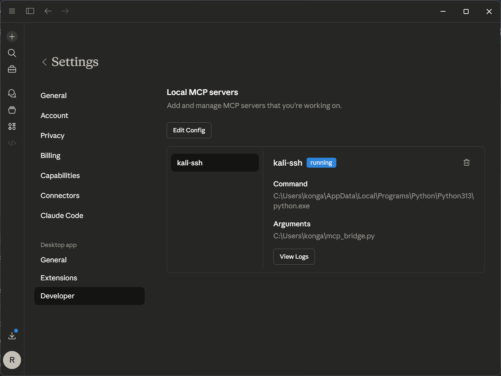
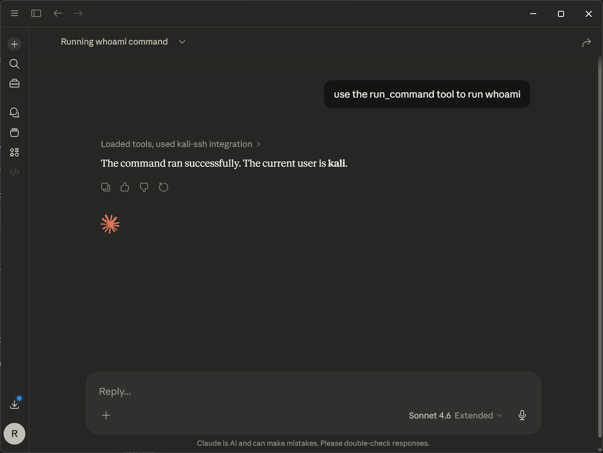
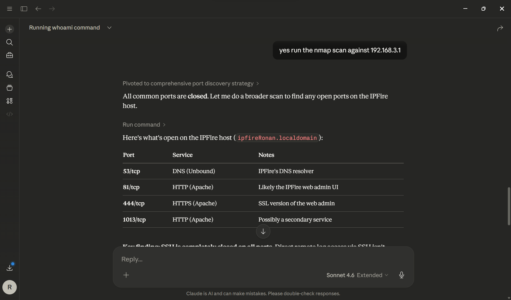
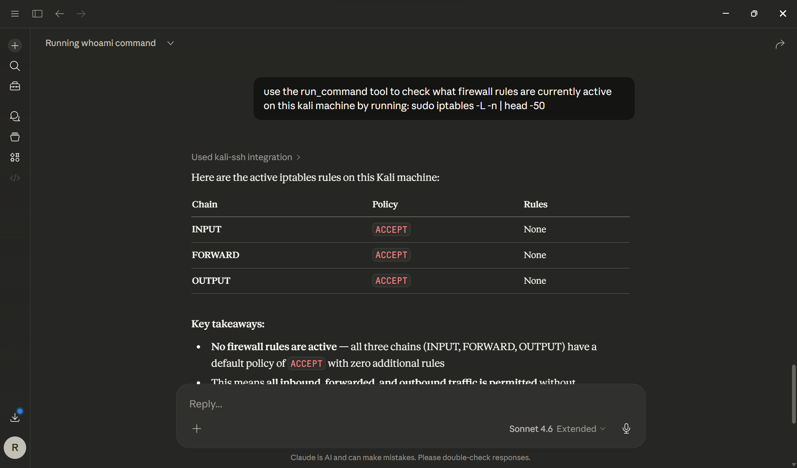

<div align="center">

```
██╗  ██╗ █████╗ ██╗     ██╗      ███████╗███████╗██╗  ██╗    ███╗   ███╗ ██████╗██████╗ 
██║ ██╔╝██╔══██╗██║     ██║      ██╔════╝██╔════╝██║  ██║    ████╗ ████║██╔════╝██╔══██╗
█████╔╝ ███████║██║     ██║█████╗███████╗███████╗███████║    ██╔████╔██║██║     ██████╔╝
██╔═██╗ ██╔══██║██║     ██║╚════╝╚════██║╚════██║██╔══██║    ██║╚██╔╝██║██║     ██╔═══╝ 
██║  ██╗██║  ██║███████╗██║      ███████║███████║██║  ██║    ██║ ╚═╝ ██║╚██████╗██║     
╚═╝  ╚═╝╚═╝  ╚═╝╚══════╝╚═╝      ╚══════╝╚══════╝╚═╝  ╚═╝    ╚═╝     ╚═╝ ╚═════╝╚═╝     
```

### 🔗 Claude Desktop ↔ Kali Linux via Model Context Protocol

<br/>

[](https://python.org)
[](https://modelcontextprotocol.io)
[](https://claude.ai)
[](https://kali.org)
[](LICENSE)
[](https://github.com/ronanlucky/kali-ssh-mcp/actions)

<br/>

> **Give Claude a terminal.** This MCP bridge lets Claude Desktop SSH into a Kali Linux host and autonomously run commands, scan networks, inspect firewalls, and reason about results — all from a natural language conversation.

<br/>

</div>

---

## 📸 Demo

<div align="center">

| MCP Config | Claude Connected |
|:---:|:---:|
|  |  |

| whoami via MCP | nmap via Claude |
|:---:|:---:|
|  |  |

<br/>


*Claude reviewing live iptables rules on Kali*

</div>

---

## ⚡ What This Does

Once configured, Claude Desktop gains the ability to:

| Capability | Example Prompt |
|---|---|
| 🔍 Network recon | `"Run nmap -sV against 192.168.3.1"` |
| 🛡️ Firewall inspection | `"Check what iptables rules are active"` |
| 🧠 Log analysis | `"Parse the last 50 lines of auth.log"` |
| ⛓️ Command chaining | Claude autonomously pivots between tools |

---

## 🏗️ Architecture

```
┌─────────────────────┐
│   Claude Desktop    │
│                     │
│  "run nmap scan..." │
└────────┬────────────┘
         │
         │  JSON-RPC over stdio
         │  (MCP Protocol 2024-11-05)
         ▼
┌─────────────────────┐
│   mcp_bridge.py     │
│                     │
│  • MCP server       │
│  • Tool handler     │
│  • SSH client       │
└────────┬────────────┘
         │
         │  SSH (paramiko)
         │  port 22
         ▼
┌─────────────────────┐
│   Kali Linux Host   │
│                     │
│  stdout / stderr    │
│  ──────────────►    │
└─────────────────────┘
```

---

## 🚀 Setup

### Prerequisites

```bash
pip install paramiko
```

- Python 3.10+
- [Claude Desktop](https://claude.ai/download) with MCP support
- Kali Linux host reachable over SSH

---

### 1️⃣ Clone

```bash
git clone https://github.com/ronanlucky/kali-ssh-mcp.git
cd kali-ssh-mcp
```

### 2️⃣ Configure SSH target

Edit the top of `mcp_bridge.py`:

```python
SSH_HOST = "192.168.x.x"    # Your Kali IP
SSH_PORT = 22
SSH_USER = "kali"
SSH_PASS = "kali"           # ⚠️ Use key-based auth in production
```

### 3️⃣ Add to Claude Desktop

Open **Claude Desktop → Settings → Developer → Edit Config** and add:

```json
{
  "mcpServers": {
    "kali-ssh": {
      "command": "C:\\Path\\To\\python.exe",
      "args": ["C:\\Path\\To\\mcp_bridge.py"]
    }
  }
}
```

### 4️⃣ Restart Claude Desktop

The `kali-ssh` server should appear as **🟢 running** in Developer settings.

---

## 💬 Usage

Just talk to Claude naturally:

```
Use the run_command tool to run: nmap -sV 192.168.3.1
```
```
Run: sudo iptables -L -n | head -50
```
```
Check who is currently logged into the system
```

Claude executes over SSH and reasons about the output inline.

---

## 📁 File Structure

```
kali-ssh-mcp/
├── 📄 mcp_bridge.py          # MCP server + SSH bridge
├── 📄 README.md
├── 📄 .gitignore
└── 📂 screenshots/
    ├── mcp-config.png
    ├── claude-connected-kali.png
    ├── whoami-result.png
    ├── nmap-ipfire.png
    └── iptables-review.png
```

---

## ⚠️ Security Notes

> This tool is intended for **lab and CTF environments only.**

- 🔑 Use key-based SSH authentication in production
- 🔒 Restrict SSH access to trusted hosts only  
- 🚫 Never run against systems without explicit permission
- 📋 All commands are logged to `mcp_bridge.log`

---

## 📄 License

MIT — see [LICENSE](LICENSE)

---

<div align="center">

Built for security research and lab environments · Powered by [Anthropic MCP](https://modelcontextprotocol.io)

</div>
